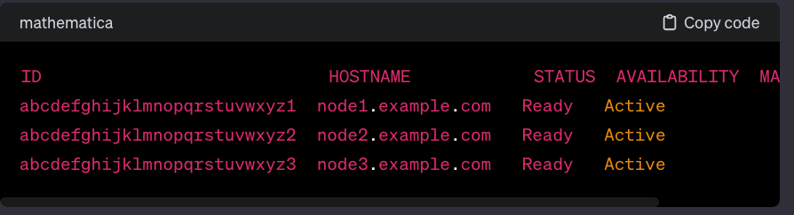
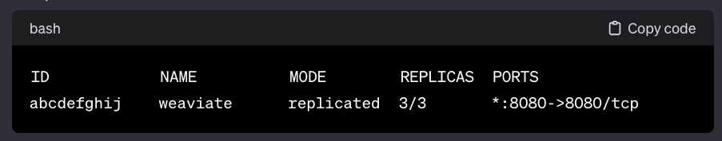

# Configure High ability for Weaviate

### I. Quy trình tổng thể

 1. Chuẩn Bị Môi Trường:
Cài đặt Docker và Docker Swarm trên mỗi máy chủ trong cụm.

2. Triển Khai Weaviate Stack:
Tạo một tệp docker-compose.yml để đặc tả dịch vụ Weaviate và các cấu hình liên quan.
Sử dụng Stack để triển khai Weaviate trên Docker Swarm.

  ```bash
version: '3.7'

services:
  weaviate:
    image: semitechnologies/weaviate:latest
    ports:
      - "8080:8080"
    deploy:
      replicas: 3
```
Trong ví dụ trên, replicas: 3 sẽ triển khai 3 bản sao của Weaviate trên cụm.

3. Đảm Bảo Tính Nhất Quán Dữ Liệu:
Sử dụng lưu trữ phân tán (distributed storage) cụm lưu trữ phân tán khác để đảm bảo tính nhất quán của dữ liệu giữa các nút Weaviate.
(trong nội dung bài viết này sử dụng Weaviate Replication)

4. Quản Lý Tài Nguyên:
Cấu hình các ràng buộc tài nguyên để đảm bảo mỗi nút có đủ tài nguyên để chạy Weaviate một cách hiệu quả.

5. Mạng Cụm Docker Swarm:
Sử dụng mạng overlay trong Docker Swarm để tạo một mạng ảo cho Weaviate, giúp các container trên các nút có thể tương tác.

6. Mạng Phân Tán:
Nếu có thể, triển khai một hệ thống mạng phân tán để giảm thiểu sự phụ thuộc vào một điểm duy nhất.

7. Kiểm Thử Môi Trường:
Kiểm thử cụm Weaviate trong môi trường Docker Swarm để đảm bảo tính ổn định và tính nhất quán.

8. Quản Lý Bảo Mật:
Cấu hình bảo mật cho cụm Weaviate, bao gồm xác thực và ủy quyền.

9. Backup và Recovery:
Xác định và triển khai chiến lược sao lưu và phục hồi để đảm bảo an toàn dữ liệu và khả năng phục hồi.

10. Giám Sát và Theo Dõi:
Sử dụng công cụ giám sát như Prometheus và Grafana để theo dõi trạng thái và hiệu suất của cụm Weaviate trên Docker Swarm.

Lưu Ý:
Hãy đảm bảo rằng bạn hiểu rõ về Docker Swarm và các tính năng của nó để tận dụng hết tiềm năng của nó.
Cân nhắc sử dụng các dịch vụ mạng phân tán và cơ sở dữ liệu phân tán để tăng tính nhất quán và khả năng chịu lỗi.
Nhớ kiểm tra tài liệu Docker Swarm và Weaviate để đảm bảo rằng bạn đang triển khai đúng cách và tận dụng hết các tính năng cung cấp.


### II. Các bước triển khai HA với Weaviate và Docker Swam

#### 1. Cài đặt Weaviate với Docker Swarm

Để triển khai Weaviate với Docker Swarm, bạn cần có các tệp sau:

1.1 Tệp cấu hình cho Weaviate (weaviate-config.yml):

  ```bash
version: '3.4'

services:
  weaviate:
    image: semitechnologies/weaviate:1.23.0
    deploy:
      replicas: 3
      restart_policy:
        condition: on-failure
    environment:
      CONTEXTIONARY_URL: contextionary:9999
      SPELLCHECK_INFERENCE_API: 'http://text-spellcheck:8080'
      QUERY_DEFAULTS_LIMIT: 25
      AUTHENTICATION_ANONYMOUS_ACCESS_ENABLED: 'true'
      PERSISTENCE_DATA_PATH: '/var/lib/weaviate'
      DEFAULT_VECTORIZER_MODULE: 'text2vec-contextionary'
      ENABLE_MODULES: 'text2vec-contextionary,text-spellcheck'
      CLUSTER_HOSTNAME: 'node1'
    volumes:
      - weaviate_data:/var/lib/weaviate
  contextionary:
    image: semitechnologies/contextionary:en0.16.0-v1.2.1
    deploy:
      replicas: 1  # Adjust as needed
    environment:
      OCCURRENCE_WEIGHT_LINEAR_FACTOR: 0.75
      EXTENSIONS_STORAGE_MODE: weaviate
      EXTENSIONS_STORAGE_ORIGIN: http://weaviate:8080
      NEIGHBOR_OCCURRENCE_IGNORE_PERCENTILE: 5
      ENABLE_COMPOUND_SPLITTING: 'true'
  text-spellcheck:
    image: semitechnologies/text-spellcheck-model:pyspellchecker-en

volumes:
  weaviate_data:

```
1.2 Tệp triển khai Docker Swarm (docker-stack.yml):

 ```bash
version: '3.4'

services:
  weaviate:
    image: semitechnologies/weaviate:1.23.0
    deploy:
      replicas: 3
      restart_policy:
        condition: on-failure
    environment:
      CONTEXTIONARY_URL: contextionary:9999
      SPELLCHECK_INFERENCE_API: 'http://text-spellcheck:8080'
      QUERY_DEFAULTS_LIMIT: 25
      AUTHENTICATION_ANONYMOUS_ACCESS_ENABLED: 'true'
      PERSISTENCE_DATA_PATH: '/var/lib/weaviate'
      DEFAULT_VECTORIZER_MODULE: 'text2vec-contextionary'
      ENABLE_MODULES: 'text2vec-contextionary,text-spellcheck'
      CLUSTER_HOSTNAME: 'node1'
    volumes:
      - weaviate_data:/var/lib/weaviate
  contextionary:
    image: semitechnologies/contextionary:en0.16.0-v1.2.1
    deploy:
      replicas: 1  # Adjust as needed
    environment:
      OCCURRENCE_WEIGHT_LINEAR_FACTOR: 0.75
      EXTENSIONS_STORAGE_MODE: weaviate
      EXTENSIONS_STORAGE_ORIGIN: http://weaviate:8080
      NEIGHBOR_OCCURRENCE_IGNORE_PERCENTILE: 5
      ENABLE_COMPOUND_SPLITTING: 'true'
  text-spellcheck:
    image: semitechnologies/text-spellcheck-model:pyspellchecker-en

volumes:
  weaviate_data:

```

1.3 Triển khai Weaviate với Docker Swarm
  ```bash
docker stack deploy -c docker-stack.yml my-weaviate-stack

```

### Lưu ý:

Bạn cần đảm bảo rằng các nodes Docker Swarm của bạn đã được đặt nhãn với weaviate-node1, weaviate-node2, và weaviate-node3.
Thay thế đường dẫn và cấu hình trong tệp cấu hình Weaviate nếu cần thiết dựa trên yêu cầu của bạn.
Bạn cũng có thể điều chỉnh số lượng replicas và cấu hình của các dịch vụ khác theo nhu cầu của bạn.
Sau khi triển khai, bạn có thể kiểm tra trạng thái của Docker Stack và xem Weaviate UI thông qua địa chỉ http://localhost:8080 hoặc địa chỉ tương ứng của bạn.

####  2. Kiểm tra trạng thái sau khi cài đặt trên các nodes

2.1 Kiểm tra trạng thái cụm Docker Swarm

  ```bash
    docker node ls
```

Đảm bảo rằng tất cả các nodes được kết nối và có trạng thái "Ready".

Ví dụ:
<div style="text-align:center">
  

</div>

Nếu cụm Docker Swarm của bạn đang hoạt động tốt, kết quả sẽ hiển thị thông tin về các nodes trong cụm, bao gồm ID, HOSTNAME, STATUS (trạng thái), AVAILABILITY (khả dụng), và MANAGER STATUS (nếu node đó đang làm nhiệm vụ manager).

2.2 Kiểm Tra Trạng Thái Dịch Vụ

Sử dụng lệnh sau để kiểm tra trạng thái của dịch vụ Weaviate:

  ```bash
    docker service ls
```

Đảm bảo rằng dịch vụ Weaviate đã được triển khai và có số lượng replicas đúng trên cụm.


Ví dụ:
<div style="text-align:center">
  

</div>

2.3 Kiểm tra Truy Cập Weaviate UI

Mở trình duyệt và truy cập Weaviate UI qua địa chỉ http://<node-ip>:8080.

Kiểm tra xem Weaviate có thể được truy cập từ mỗi node không.

