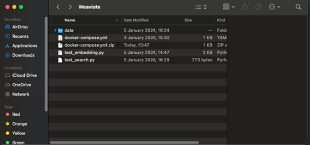

# Install Weaviate

1. **Create file `docker-compose.yml`**

   - Use Weaviate's configure tool to create the `docker-compose.yml` file

     Link: [https://weaviate.io/developers/weaviate/installation/docker-compose](https://weaviate.io/developers/weaviate/installation/docker-compose)

   - Or use the established `docker-compose.yml` file (attached)

2. **Create a folder to save project files** (Weaviate)

<div style="text-align:center">
  
</div>


3. **Enable Docker and Weaviate**

    - Open terminal
    - Go to the working directory just created above (Example)

  ```bash
    cd /Users/nad/Downloads/Weaviate
```
   - Enable Docker and Weaviate
    
   ``` bash
    docker-compose up -d && docker-compose logs -f weaviate
```
4. **Install Weaviate client**

    ``` bash
    pip install weaviate-client
   ```


